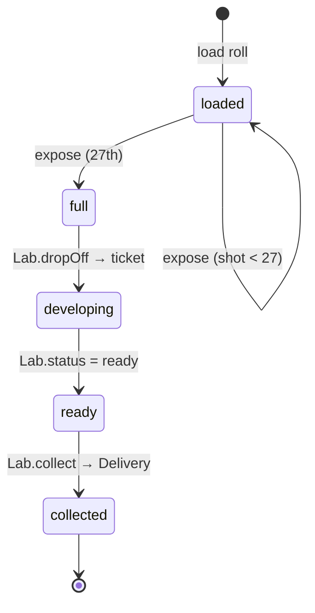

# Architecture

## Stack

- **SvelteKit 2 + Svelte 5**, `adapter-static` with SPA fallback, `ssr = false`
  → a static bundle for any HTTPS host, wrappable by **Capacitor** later.
- **TypeScript** throughout; domain logic in framework-free modules.
- **Vitest** for domain tests (`npm test`).
- Browser APIs: `getUserMedia` / `ImageCapture`, WebGL2, WebCrypto, IndexedDB,
  Storage API (`persist()`), Web Share Level 2, Vibration.

## Layout

```
src/lib/
  config.ts            developer constants (roll size, wind clicks, develop window, stock)
  i18n.ts              FR/EN strings, browser language detection
  roll/                Roll model + forward-only state machine
  camera/winder.ts     thumbwheel logic (shutter lock)
  lab/                 Lab interface + implementations (local time-lock today)
  film/stocks.ts       film look parameter sets (shader coming in phase 2)
src/routes/            the camera body screen
static/                manifest, icons
```

Rule: **UI components never hold frame pixels.** Captured frames go straight
from the capture pipeline into sealed storage; the UI only knows the counter.

## Roll state machine



Transitions are pure functions in [`roll/roll.ts`](../src/lib/roll/roll.ts);
illegal moves throw `RollError`. States only ever move forward.

## Capture pipeline (phase 1–2)

```
getUserMedia (rear, max res)
   │  shutter
   ▼
grab full-res frame ── ImageCapture.takePhoto() where available (Chrome Android)
   │                    else draw the <video> frame to a canvas (iOS Safari)
   ▼
film look (WebGL2) ─── stock curves, grain, vignette, halation, flash look,
   │                    light leak (head/tail frames), date stamp
   ▼
encode JPEG (q ≈ 0.9, 3:2)
   ▼
seal (AES-GCM, per-roll key) ──▶ IndexedDB  { rollId, index, meta, sealed }
```

The viewfinder is a separate, cheap path (small `<video>` + CSS vignette/blur);
it never shows the look.

## Sealing

- At load, each roll gets a random **AES-GCM 256** key (WebCrypto). Every frame
  is encrypted with its own IV before it touches storage.
- The key is stored alongside the roll in IndexedDB (a `CryptoKey` survives
  structured clone).
- **Local lab**: the key never leaves; collection decrypts and zips. It's a
  ritual lock, not security (D2).
- **Server labs (later)**: at drop-off the key is wrapped with the lab's public
  key and uploaded with the sealed frames, then **deleted locally** — from that
  moment the phone genuinely cannot open the roll. This is why the key is
  generated extractable and why sealing exists from day one: switching labs
  changes where the key goes, not how frames are stored.

## Labs

```ts
interface Lab {
  kind: 'local-timelock' | 'email' | 'photolab';
  dropOff(roll, frames: AsyncIterable<SealedFrame>): Promise<LabTicket>;
  status(ticket): Promise<{ state: 'developing' | 'ready' }>;
  collect(roll): Promise<Delivery>;   // archive to the device, or "sent elsewhere"
}
```

| Lab | dropOff | status | collect |
|---|---|---|---|
| `local-timelock` (MVP) | draw readyAt ∈ [24 h, 72 h], keep frames | compare clock | unseal + zip → share/download |
| `email` (next) | upload sealed frames + wrapped key | poll / push | "sent to your inbox" (`elsewhere`) |
| `photolab` (someday) | upload to a real lab API | lab status | prints by post, scans by mail |

The ticket is persisted on the roll; its `data` is private to the lab. Adding a
lab never touches the camera or the roll model.

## Storage durability

Losing a roll is the worst bug, so:

- Call `navigator.storage.persist()` at first launch.
- **iOS**: Safari can evict a *website's* storage after ~7 days without a visit;
  a PWA **installed to the home screen** is not subject to that. Onboarding on
  iOS must push "Add to Home Screen" before loading the first roll.
- Write each frame in its own IndexedDB transaction before the counter moves.

## Platform limits

| Topic | Android Chrome | iOS Safari (PWA) | Plan |
|---|---|---|---|
| Rear camera via `getUserMedia` | ✅ | ✅ (installed PWA ok) | — |
| Full-res still (`ImageCapture.takePhoto`) | ✅ | ❌ | fall back to video-frame grab; request 4K stream |
| Torch for the flash | ✅ `torch` constraint | ⚠️ unreliable — verify on bench | simulated flash look (Q2) |
| Background "ready" notification | Web Push (server) | Web Push for installed PWAs, iOS 16.4+ (server) | check on open for the local lab (Q6) |
| Haptics (`navigator.vibrate`) | ✅ | ❌ | sound carries the feedback on iOS |
| Share files (Web Share L2) | ✅ | ✅ | download fallback |

Capacitor removes most of these limits (native camera, haptics, local
notifications) without changing the domain code.
